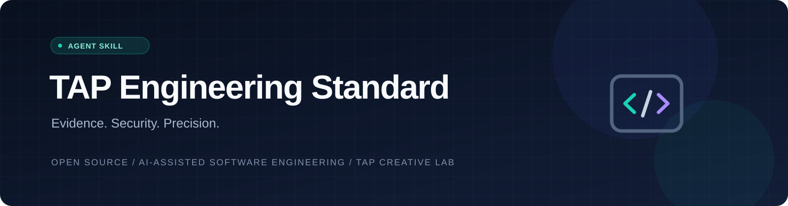
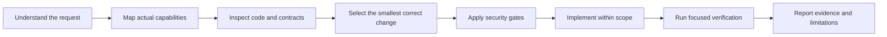

<div align="center">



# TAP Engineering Standard

### Evidence-led engineering for AI-assisted software development.

[](LICENSE)
[](https://github.com/thalesandradepereira/tap-engineering-standard/actions/workflows/validate-skill.yml)
[](skills/tap-engineering-standard/SKILL.md)
[](SECURITY.md)

**[Português do Brasil](README.pt-BR.md)** · **[The skill](skills/tap-engineering-standard/SKILL.md)** · **[Security](SECURITY.md)** · **[Contributing](CONTRIBUTING.md)**

</div>

---

TAP Engineering Standard is an open, inspectable Agent Skill that gives compatible AI coding assistants a consistent operating model: understand the task, map available capabilities, inspect real code, implement the smallest correct solution, protect trust boundaries, and verify what actually happened.

It is an instruction package—not a background service, a model, an MCP server, a browser extension, or a permission bypass. It does not install hooks, execute hidden scripts, collect telemetry, or grant access to external accounts.

> **Core principle:** thorough analysis, minimal implementation, explicit authorization, verifiable results.

## Why this exists

AI-assisted development can fail in predictable ways: unnecessary abstractions, unverified assumptions, oversized context, unsafe installers, accidental permission changes, and confident claims about tests that never ran.

This skill turns those failure modes into explicit engineering checkpoints without forcing mechanical verbosity or weakening the user's actual requirements.

## What makes this skill different

| Common agent failure | TAP Engineering Standard response |
| --- | --- |
| The agent assumes a tool or account is available. | It verifies current capabilities and permissions before choosing a workflow. |
| A green workflow is reported as a delivered email. | It traces collection, localization, provider acceptance, and downstream delivery separately. |
| A dashboard looks correct while filtered exports drift. | It reconciles source totals, bidirectional filters, drill-down state, and exported rows. |
| A popular repository is treated as automatically safe. | It inspects provenance, licenses, installers, hooks, telemetry, and unresolved defects. |
| The model generates a large speculative rewrite. | It reuses established project patterns and implements the smallest complete fix. |
| A queued job or build is described as a passed production test. | It distinguishes submitted, queued, running, successful, failed, and unverified states. |

Specialist knowledge is loaded progressively: the core skill stays concise, while dedicated security and QA playbooks are consulted only when the task warrants them.

## The engineering loop



| Stage | Practical behavior | Protected outcome |
| --- | --- | --- |
| Task contract | Identify deliverables, constraints, affected systems, and authority. | The agent does not expand the request. |
| Capability routing | Use only capabilities available in the current environment. | No invented tools, integrations, or permissions. |
| Codebase orientation | Inspect files, callers, tests, configuration, and data contracts. | Changes follow the actual architecture. |
| Minimal implementation | Reuse existing patterns, standard libraries, and native features first. | Less unnecessary code and lower maintenance cost. |
| Security gate | Inspect provenance, licensing, dependencies, hooks, telemetry, and data paths. | Safer supply-chain and trust-boundary decisions. |
| Verification | Run checks proportionate to the change and preserve exact failures. | Results are backed by observable evidence. |

## What it covers

- Programming, architecture, debugging, refactoring, code review, and QA.
- GitHub repository analysis and supply-chain evaluation.
- HTML, CSS, JavaScript, dashboards, D3.js, cross-filtering, and data pipelines.
- AI agents, Agent Skills, plugins, connectors, MCP servers, APIs, and automation.
- Performance, accessibility, deployment, application security, and regression testing.

The skill deliberately excludes general nontechnical prose, legal, medical, and financial work unless the actual task is the engineering of software for those domains.

## Quick start

### 1. Inspect before you trust

Read the full [`SKILL.md`](skills/tap-engineering-standard/SKILL.md), the [MIT license](LICENSE), and the [security policy](SECURITY.md). The package is plain text and can be reviewed without running an installer.

### 2. Add the skill to a compatible environment

```bash
git clone https://github.com/thalesandradepereira/tap-engineering-standard.git
cd tap-engineering-standard
python3 scripts/validate_skill.py
```

The distributable skill is the complete directory below:

```text
skills/tap-engineering-standard/
├── SKILL.md
├── agents/
│   └── openai.yaml
├── assets/
│   └── icon.svg
└── references/
    ├── qa-playbooks.md
    └── security-gate.md
```

Copy or import that **entire directory** using the mechanism supported by your coding assistant. Keep the repository-level documentation and CI files outside the installed skill package.

### 3. Invoke it explicitly

```text
@tap-engineering-standard analyze this repository, identify the root cause,
implement the smallest safe fix, and run the relevant regression checks.
```

Automatic activation depends on the host product, the skill being installed, the current conversation, and whether the request matches the skill description. A GitHub URL by itself does **not** install or enable a skill.

## Platform compatibility

| Environment | Recommended use | Important limitation |
| --- | --- | --- |
| ChatGPT on the web | Add the skill through the available Skills experience, then invoke `@tap-engineering-standard` where supported. | Availability, import options, and automatic activation depend on the account and product surface. |
| ChatGPT mobile | Open the available Skills experience and add or enable the skill for that surface when supported. | Desktop/web and mobile availability or installation state may differ; a GitHub link is not an installation. |
| OpenAI Codex | Install the complete skill directory using the skill-discovery mechanism available in that Codex environment. | Filesystem paths and management commands vary by Codex surface and deployment. |
| Other Agent Skill-compatible tools | Import the directory according to the tool's own Agent Skill documentation. | OpenAI-specific `agents/openai.yaml` metadata may be ignored by other platforms. |
| Projects and custom instructions | Reference the installed skill in relevant project instructions or invoke it explicitly. | Instructions can recommend a skill but cannot create access, install software, or override permissions. |

### Example standing instruction

```text
For software engineering, architecture, repository analysis, dashboards,
AI agents, Agent Skills, plugins, or MCP work, apply @tap-engineering-standard
when it is installed and available. Never install hooks or CLIs, change
permissions, or transmit sensitive code without compatible authorization.
```

## Example prompts

**Repository audit**

```text
@tap-engineering-standard audit this repository. Inspect maintenance,
license, dependencies, installation scripts, network calls, hooks,
permissions, tests, and unresolved security issues. Classify it as
Adopt, Pilot, or Reject for now, with evidence for each conclusion.
```

**Root-cause debugging**

```text
@tap-engineering-standard trace the failing workflow from entry point to
downstream consumers. Identify the root cause, preserve existing behavior,
implement the smallest safe fix, and run targeted regression tests.
```

**Interactive dashboard**

```text
@tap-engineering-standard improve this HTML and D3.js dashboard. Validate
input schemas, bidirectional cross-filtering, drill-down state, KPI totals,
responsive behavior, accessibility, and filtered Excel exports.
```

## Security model

The skill is designed to operate with the permissions already granted by the host environment. It explicitly prohibits silent global hooks, automatic approval, permission bypasses, blind remote installers, and unapproved disclosure of source code or credentials.

Its optional discussion of knowledge graphs does not install Graphify or any other third-party tool. Graph-based analysis is considered only when an existing, authorized, relevant tool is already available and its output can be checked.

See [SECURITY.md](SECURITY.md) for scope, supply-chain expectations, and vulnerability-reporting guidance.

## Specialist playbooks

The core skill loads supplementary guidance only when the task requires it:

- [`references/security-gate.md`](skills/tap-engineering-standard/references/security-gate.md): provenance, license boundaries, dependency inspection, hook behavior, data-flow mapping, prompt injection, permission bypasses, and Adopt/Pilot/Reject decisions.
- [`references/qa-playbooks.md`](skills/tap-engineering-standard/references/qa-playbooks.md): dashboard reconciliation, bidirectional cross-filtering, localized email delivery, scheduled workflows, API integrations, Agent Skills, GitHub releases, and browser-visible behavior.

This structure improves task-specific depth without forcing every conversation to load the entire audit manual.

## Validation and continuous integration

Run the same dependency-free checks used by GitHub Actions:

```bash
python3 scripts/validate_skill.py
python3 -m unittest discover -s tests -v
```

The validator checks the required YAML frontmatter, canonical name, description quality, package metadata, reference integrity, SVG security, required documentation, and security-sensitive repository invariants. The workflow requests read-only repository permissions and does not require secrets.

## Repository layout

```text
tap-engineering-standard/
├── README.md
├── README.pt-BR.md
├── LICENSE
├── SECURITY.md
├── CONTRIBUTING.md
├── assets/tap-engineering-banner.svg
├── skills/tap-engineering-standard/
│   ├── SKILL.md
│   ├── agents/openai.yaml
│   ├── assets/icon.svg
│   └── references/
│       ├── qa-playbooks.md
│       └── security-gate.md
├── scripts/validate_skill.py
├── tests/test_validate_skill.py
└── .github/workflows/validate-skill.yml
```

## Frequently asked questions

**Does opening the repository automatically install the skill?** No. You must add the complete skill package through a compatible host's own supported installation mechanism.

**Will this make a model smarter or guarantee more GitHub stars?** No repository can guarantee either outcome. The skill improves operational discipline, traceability, and verification; adoption depends on genuine utility, discoverability, maintenance, and community trust.

**Does it require Graphify, an MCP server, a paid API, or a browser extension?** No. Those capabilities are considered only if they already exist, are authorized, and are actually useful for the requested task.

**Can I customize it?** Yes. The MIT license permits modification and redistribution. Review your changes, preserve attribution, and rerun the validation suite.

## License and attribution

Released under the [MIT License](LICENSE).

Created by **Thales Andrade Pereira** · **TAP Creative Lab**.

The project is independent and is not endorsed by or affiliated with OpenAI, Anthropic, GitHub, Graphify, or any other mentioned platform or project.

---

<div align="center">

**Build only what is necessary. Verify what matters. Protect what users trust.**

</div>
