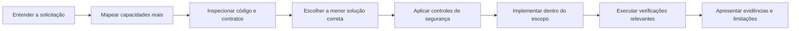

<div align="center">


# TAP Engineering Standard

### Engenharia orientada por evidências para desenvolvimento assistido por IA.

[](LICENSE)
[](https://github.com/thalesandradepereira/tap-engineering-standard/actions/workflows/validate-skill.yml)
[](skills/tap-engineering-standard/SKILL.md)
[](SECURITY.md)

</div>

**[English](README.md)** · **[A Skill](skills/tap-engineering-standard/SKILL.md)** · **[Segurança](SECURITY.md)** · **[Contribuição](CONTRIBUTING.md)**

---

TAP Engineering Standard é uma Agent Skill aberta e auditável que estabelece um padrão consistente para assistentes de programação compatíveis: compreender a solicitação, mapear capacidades reais, inspecionar o código, implementar a menor solução correta, preservar controles de segurança e verificar o resultado obtido.

O projeto é um pacote de instruções. Não é serviço em segundo plano, modelo de IA, servidor MCP, extensão de navegador ou mecanismo para contornar permissões. Não instala hooks, não executa scripts ocultos, não coleta telemetria e não concede acesso a contas externas.

> **Princípio central:** análise aprofundada, implementação enxuta, autorização explícita e resultados verificáveis.

## Por que este projeto existe

O desenvolvimento assistido por IA pode produzir problemas recorrentes: abstrações desnecessárias, conclusões sem evidência, contexto excessivo, instaladores inseguros, alterações indevidas de permissões e afirmações sobre testes que nunca foram executados.

A Skill transforma esses riscos em critérios objetivos de trabalho, sem reduzir a profundidade solicitada pelo usuário nem comprometer requisitos técnicos legítimos.

## O que diferencia esta Skill

| Problema recorrente em agentes | Resposta do TAP Engineering Standard |
| --- | --- |
| O agente presume acesso a uma ferramenta ou conta. | Verifica capacidades e permissões efetivamente disponíveis antes de definir a execução. |
| Um workflow verde é apresentado como e-mail entregue. | Rastreia coleta, geração por idioma, aceitação do provedor e confirmação posterior separadamente. |
| O dashboard parece correto, mas a exportação não respeita os filtros. | Reconcilia dados de origem, cross-filtering, drill-down e linhas exportadas. |
| Um repositório popular é considerado automaticamente seguro. | Examina procedência, licença, instaladores, hooks, telemetria e vulnerabilidades pendentes. |
| O modelo produz uma reescrita grande e especulativa. | Reutiliza padrões existentes e implementa a menor correção completa. |
| Um job enfileirado é descrito como teste concluído. | Diferencia estados enviado, enfileirado, executando, aprovado, reprovado e não verificado. |

O conhecimento especializado é carregado progressivamente: o núcleo da Skill permanece objetivo, enquanto os playbooks de segurança e QA são consultados somente quando a tarefa exige aprofundamento.

## Ciclo de engenharia



| Etapa | Comportamento esperado | Resultado protegido |
| --- | --- | --- |
| Contrato da tarefa | Identificar entregáveis, restrições, sistemas afetados e autorização. | A execução não extrapola o pedido. |
| Roteamento de capacidades | Utilizar somente recursos acessíveis no ambiente atual. | Ferramentas, integrações e permissões não são inventadas. |
| Orientação no código | Examinar arquivos, chamadas, testes, configurações e contratos de dados. | As alterações respeitam a arquitetura existente. |
| Implementação mínima | Priorizar padrões existentes, biblioteca padrão e recursos nativos. | Menos complexidade e menor custo de manutenção. |
| Controle de segurança | Avaliar procedência, licença, dependências, hooks, telemetria e fluxos de dados. | Decisões mais seguras sobre cadeia de suprimentos. |
| Verificação | Executar testes proporcionais ao risco e preservar erros relevantes. | Conclusões sustentadas por evidências observáveis. |

## Aplicações práticas

- Programação, arquitetura, depuração, refatoração, revisão de código e QA.
- Auditoria de repositórios GitHub e análise da cadeia de suprimentos.
- HTML, CSS, JavaScript, dashboards, D3.js, cross-filtering e tratamento de dados.
- Agentes de IA, Agent Skills, plugins, conectores, servidores MCP, APIs e automações.
- Desempenho, acessibilidade, implantação, segurança de aplicações e testes de regressão.

A Skill não se destina diretamente a textos gerais ou análises jurídicas, médicas e financeiras. Pode ser utilizada quando a demanda efetiva for desenvolver, testar ou auditar software relacionado a essas áreas.

## Primeiros passos

### 1. Audite antes de utilizar

Leia integralmente o [`SKILL.md`](skills/tap-engineering-standard/SKILL.md), a [licença MIT](LICENSE) e a [política de segurança](SECURITY.md). O conteúdo pode ser verificado sem executar instaladores externos.

### 2. Adicione a Skill em um ambiente compatível

```bash
git clone https://github.com/thalesandradepereira/tap-engineering-standard.git
cd tap-engineering-standard
python3 scripts/validate_skill.py
```

O pacote distribuível corresponde ao diretório completo:

```text
skills/tap-engineering-standard/
├── SKILL.md
├── agents/
│   └── openai.yaml
├── assets/
│   └── icon.svg
└── references/
    ├── qa-playbooks.md
    └── security-gate.md
```

Copie ou importe **todo o diretório** utilizando o mecanismo disponibilizado pelo assistente de programação escolhido. A documentação e os arquivos de automação do repositório não precisam ser incorporados à Skill instalada.

### 3. Solicite a ativação explicitamente

```text
@tap-engineering-standard analise este repositório, identifique a causa raiz,
implemente a menor correção segura e execute os testes de regressão relevantes.
```

A ativação automática depende da plataforma, da instalação da Skill, da conversa atual e da compatibilidade entre a tarefa e sua descrição. Um link do GitHub, isoladamente, **não** instala nem habilita a Skill.

## Compatibilidade por plataforma

| Ambiente | Forma recomendada de utilização | Limitação importante |
| --- | --- | --- |
| ChatGPT na web | Adicione a Skill pela experiência de Skills disponível e invoque `@tap-engineering-standard` quando compatível. | Disponibilidade, importação e ativação automática dependem da conta e da interface utilizada. |
| ChatGPT no aplicativo | Abra a área de Skills disponível e adicione ou habilite a Skill naquela interface, quando houver suporte. | O estado de instalação e a disponibilidade podem variar entre web, desktop e aplicativo. |
| OpenAI Codex | Instale o diretório completo conforme o mecanismo de descoberta de Skills do ambiente Codex utilizado. | Caminhos e comandos de gerenciamento variam conforme o produto e a implantação. |
| Outras ferramentas compatíveis | Importe o diretório conforme a documentação da ferramenta e valide os requisitos de segurança. | Os metadados `agents/openai.yaml` podem ser ignorados por outras plataformas. |
| Projetos e personalização | Mencione a Skill instalada nas instruções do projeto ou solicite sua execução explicitamente. | Instruções não instalam software, não concedem permissões e não criam acesso externo. |

### Exemplo de instrução permanente

```text
Em tarefas de programação, arquitetura, análise de repositórios, dashboards,
agentes de IA, Agent Skills, plugins ou MCP, aplique @tap-engineering-standard
quando a Skill estiver instalada e disponível. Não instale hooks ou CLIs,
não altere permissões e não compartilhe código sensível sem autorização.
```

## Exemplos práticos

**Auditoria de repositório**

```text
@tap-engineering-standard audite este repositório. Verifique manutenção,
licença, dependências, scripts de instalação, chamadas de rede, hooks,
permissões, testes e problemas de segurança em aberto. Classifique a solução
como Adotar, Piloto ou Rejeitar por enquanto, apresentando as evidências.
```

**Correção de causa raiz**

```text
@tap-engineering-standard rastreie a falha desde o ponto de entrada até os
componentes afetados. Identifique a causa raiz, preserve o comportamento
existente, implemente a menor correção segura e execute testes direcionados.
```

**Dashboard interativo**

```text
@tap-engineering-standard evolua este dashboard HTML com D3.js. Valide
estrutura dos dados, cross-filtering bidirecional, drill-down, totalização
de KPIs, responsividade, acessibilidade e exportação Excel com filtros.
```

## Modelo de segurança

A Skill opera exclusivamente com as permissões já concedidas pelo ambiente. Proíbe hooks globais silenciosos, aprovação automática, contorno de controles, instaladores remotos não auditados e compartilhamento não autorizado de código ou credenciais.

A orientação opcional por grafos não instala Graphify nem qualquer ferramenta externa. Seu uso é considerado somente quando o recurso já existe, está autorizado, contribui efetivamente para a tarefa e pode ser conferido contra o código-fonte.

Consulte [SECURITY.md](SECURITY.md) para conhecer o escopo, os controles e o procedimento de comunicação responsável de vulnerabilidades.

## Playbooks especializados

A Skill principal consulta materiais adicionais somente quando a tarefa exige:

- [`references/security-gate.md`](skills/tap-engineering-standard/references/security-gate.md): procedência, limites de licença, dependências, hooks, fluxo de dados, injeção de instruções, contorno de permissões e decisões de adoção.
- [`references/qa-playbooks.md`](skills/tap-engineering-standard/references/qa-playbooks.md): reconciliação de dashboards, cross-filtering bidirecional, e-mails em múltiplos idiomas, automações agendadas, APIs, Agent Skills, releases GitHub e validação visual.

Essa organização amplia a profundidade técnica sem carregar um manual completo em toda conversa.

## Validação e integração contínua

Execute localmente as mesmas verificações sem dependências externas utilizadas no GitHub Actions:

```bash
python3 scripts/validate_skill.py
python3 -m unittest discover -s tests -v
```

O validador examina frontmatter YAML, nome canônico, qualidade da descrição, metadados, integridade das referências, segurança dos arquivos SVG, documentação obrigatória e invariantes de segurança. O workflow utiliza permissão de leitura, action oficial fixada por commit, persistência de credenciais desabilitada e nenhuma dependência de segredos.

## Estrutura do repositório

```text
tap-engineering-standard/
├── README.md
├── README.pt-BR.md
├── LICENSE
├── SECURITY.md
├── CONTRIBUTING.md
├── assets/tap-engineering-banner.svg
├── skills/tap-engineering-standard/
│   ├── SKILL.md
│   ├── agents/openai.yaml
│   ├── assets/icon.svg
│   └── references/
│       ├── qa-playbooks.md
│       └── security-gate.md
├── scripts/validate_skill.py
├── tests/test_validate_skill.py
└── .github/workflows/validate-skill.yml
```

## Perguntas frequentes

**Abrir o repositório instala a Skill automaticamente?** Não. É necessário adicionar o pacote completo pelo mecanismo de instalação efetivamente disponibilizado pela plataforma utilizada.

**A Skill garante inteligência superior ou muitas stars no GitHub?** Não. Nenhum repositório pode garantir esses resultados. A proposta melhora disciplina operacional, rastreabilidade e verificação; a adoção depende de utilidade real, manutenção, descoberta e confiança da comunidade.

**É necessário instalar Graphify, servidor MCP, API paga ou extensão?** Não. Essas capacidades são consideradas somente quando já existem, estão autorizadas e contribuem concretamente para a tarefa.

**Posso adaptar a Skill?** Sim. A licença MIT permite modificação e redistribuição. Revise as alterações, preserve os créditos e execute novamente a suíte de validação.

## Licença e autoria

Distribuído sob a [Licença MIT](LICENSE).

Criado por **Thales Andrade Pereira** · **TAP Creative Lab**.

Projeto independente, sem endosso ou vínculo oficial com OpenAI, Anthropic, GitHub, Graphify ou qualquer outra plataforma mencionada.

---

<div align="center">

**Construa apenas o necessário. Verifique o que importa. Proteja a confiança do usuário.**

</div>
